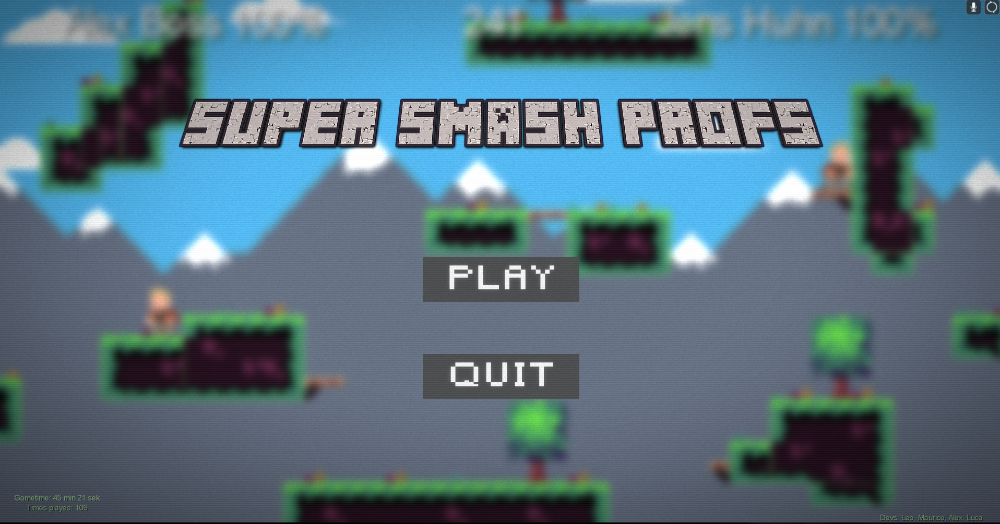
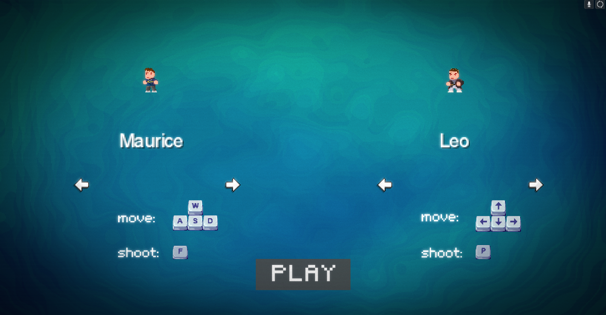
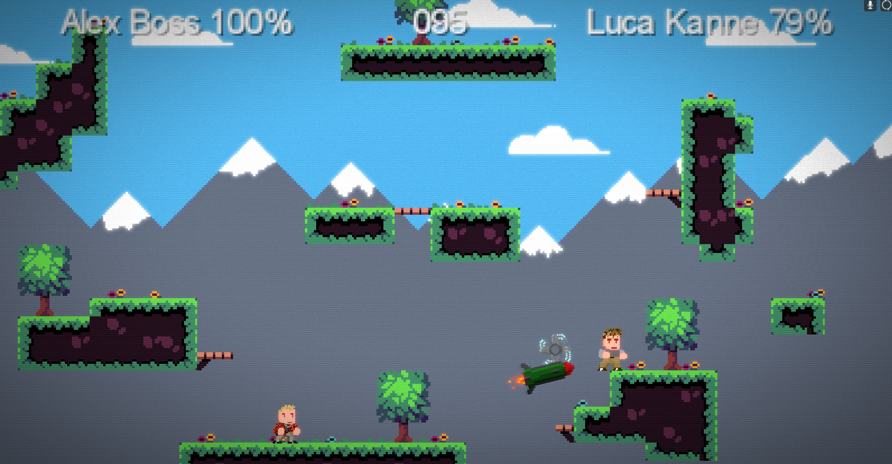
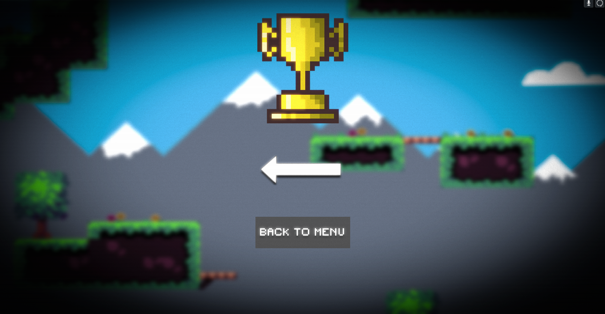

```
   _____                          _____                     _       _____            __     
  / ____|                        / ____|                   | |     |  __ \          / _|    
 | (___  _   _ _ __   ___ _ __  | (___  _ __ ___   __ _ ___| |__   | |__) | __ ___ | |_ ___ 
  \___ \| | | | '_ \ / _ \ '__|  \___ \| '_ ` _ \ / _` / __| '_ \  |  ___/ '__/ _ \|  _/ __|
  ____) | |_| | |_) |  __/ |     ____) | | | | | | (_| \__ \ | | | | |   | | | (_) | | \__ \
 |_____/ \__,_| .__/ \___|_|    |_____/|_| |_| |_|\__,_|___/_| |_| |_|   |_|  \___/|_| |___/
              | |                                                                           
              |_|                                                                           
```
# Super Smash Profs

A Java platformer which is inspired by Super Smash Bros and developed with libGDX and Tiled.

## Table of Contents

- [Description](#description)
- [Installation](#installation)
  - [How can I edit the Project?](#how-can-i-edit-the-project)
  - [How can I play the game?](#how-can-i-play-the-game)
- [Authors](#authors)
- [Screenshots](#screenshots)
- [Documentation](#documentation)
- [Feedback](#feedback)

## Description

A multiplayer platform game playable on only one keyboard. There are features such as
character selection, various abilities and much more.

## Installation

Clone this repository to a directory of choice and open the project using IntelliJ IDEA.
Make sure to download all the mandatory gradle dependencies.

### How can I edit the Project?

Simply open the build.gradle in an IDE of your choice

### How can I play the game?

#### You can start the game by running:

```path
desktop/module/build/libs/desktop-1.0.jar
```

#### If you want to generate your own .jar, then run this command with gradle:

```gradle
gradlew desktop:dist
```

### Running the CLI directly in IntelliJ
To start the game, simply add a new run configuration and type in "run".

## Authors

- [@lv042](https://github.com/lv042)
- [@ll071]
- [@md147]
- [@ab306]

### License

[Apache 2.0](https://choosealicense.com/licenses/apache-2.0/)


### Built With

<a href="https://docs.oracle.com/javase/tutorial/index.html"></a> <a href="https://libgdx.com/"></a>  <a href="https://www.mapeditor.org/"></a>


## Screenshots






## Documentation

https://drive.google.com/file/d/15gitvx5r0FNpOf9QIgNHDvPcJrHTNwK1/view?usp=sharing

## Feedback

If you have any feedback, please reach out to us at luca.v.kannen@gmail.com
